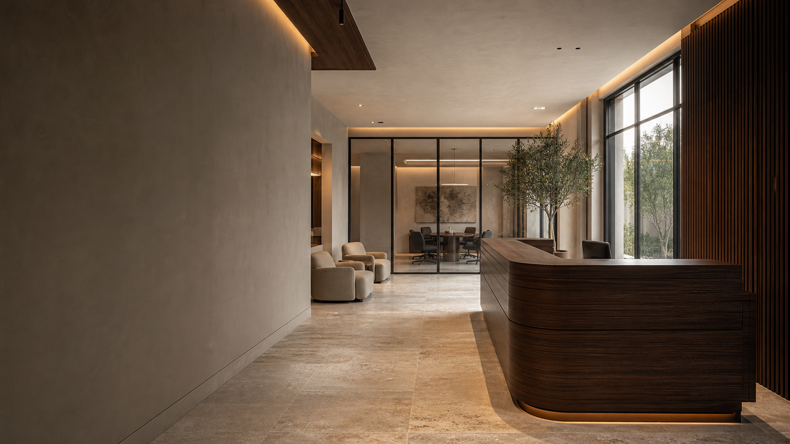

# WOODEX INTERIOR
## Digital flagship · Strategy & experience master plan

**Lahore roots. Nationwide reach.**  
Prepared 11 September 2026 · Direction: Linoxa-inspired structure + selective cinematic 3D  
**Status: planning deliverable, not an implemented or audited live website.**

*Art-direction study — AI-generated concept, not a Woodex project. This image establishes atmosphere; it is not an interactive 3D model.*

> **The central idea: A space that means business.**  
> Turn the visitor’s uncertainty about layouts, materials and delivery into a clear next step. Let the architecture provide the spectacle. Let the copy provide confidence.

---

## 01 — Decisions, assumptions & scope

### Confirmed
- Brand supplied: Woodex Interior. Final legal name and wordmark remain to be confirmed.
- Based in Lahore, with services nationwide in Pakistan.
- Deliver a complete master plan first; do not build the website in this phase.
- Use Linoxa Home Two as the reference, with selective 3D enhancements.
- Generated concept imagery is acceptable.

### Working assumptions requiring approval
- Office interior design is the lead service because it was explicitly highlighted in the brief. Residential and other commercial categories below are proposals, not verified capabilities.
- Primary audience: business owners, founders, operations leaders and workplace/facilities decision-makers. Secondary audience: homeowners and retail operators if those services are confirmed.
- English-first site. Urdu assistance or a full Urdu version should depend on actual sales needs; do not publish machine-translated city pages.
- “Full-Suite art gallery” is provisionally interpreted as a complete project and concept gallery, not an art-sales business or specialist gallery-design service.
- Budget, typical project size, consultation fees, delivery model, in-house manufacturing, credentials, founder history, address, phone and real portfolio are unknown.
- Assume mobile-first discovery for design decisions, not as a claimed analytics finding. Validate device mix after launch.

### What “100% same theme” means here
The later selection of **reference + selective 3D** means a close structural adaptation rather than a literal pixel-identical copy. A hybrid with different imagery, text and 3D cannot honestly be described as 100% identical.

If exact template fidelity becomes the priority, obtain the appropriate Linoxa template license and editable source, then verify permitted use and individual asset rights. Do not assume a Webflow template license automatically permits redistribution or conversion of its source into a WordPress product. Do not reuse its client logos, placeholder identity or third-party images without permission.

This plan specifies an original Woodex visual system informed by the reference. Exact font, color, breakpoint and animation matching needs rendered desktop/mobile inspection and licensed source access before build sign-off.

### Deliverables in this package
Brand strategy; competitor/content review; reference adaptation; sitemap; homepage narrative and copy; complete proposed services-hub and office-service copy; gallery specifications; visual system; hero art direction; motion choreography; SEO architecture; WordPress-oriented engineering plan; conversion strategy; prioritized quality risks; evening performance plan; launch checklist; one generated office concept image.

---

## 02 — Research: what is observed, and what is not

Research reviewed the publicly retrievable page content on 11 September 2026. It is a **content and information-architecture review**, not a rendered visual, accessibility, browser or performance audit. Repeated text in extracted pages may represent responsive duplicates, sliders or hidden elements; it does not prove visible clutter.

### Linoxa Home Two — reference anatomy
The retrieved page contains multiple hero headlines and repeated CTAs; a partner/logo area; service narratives; a commercial-architecture feature; building/documentation and interior-design/consultation/3D-modeling content; large image features; a journal; contact CTA; and an oversized architecture/footer identity. Source: [Linoxa Home Two](https://linoxa.webflow.io/home-two).

| Reference element | Woodex adaptation | Intentional departure |
|---|---|---|
| Multiple introductory headlines | One immediately readable office-led promise | No autoplay text carousel hiding the value proposition |
| Partner section | Verified project proof when supplied; process evidence otherwise | No decorative fake logo strip |
| Service narratives and large images | Numbered service index with relevant interior imagery | Concrete scopes instead of abstract architecture claims |
| Commercial feature | Office interior design feature | Specific workplace outcomes and deliverables |
| Documentation / modeling content | Brief → plan → visualize → deliver sequence | Explain what a client approves at each step |
| Large spatial imagery | One hero scene plus restrained materials sequence | No expensive canvas in every section |
| Journal | Practical planning, budget and materials guides | Buyer questions rather than trend filler |
| Closing contact and large wordmark | Short brief form and oversized WOODEX footer | Pakistan coverage and verified contact information |

**Before implementation:** capture the reference at 1440, 1024, 768 and 390 px; record section heights, grid ratios, computed typography, image crops, nav behavior, hover states and reduced-motion behavior. Produce an approved comparison sheet. The tokens in this plan are proposed Woodex choices, not measured Linoxa values.

### Competitor positioning

| Competitor | Observed public-page strengths | Strategic opening for Woodex |
|---|---|---|
| Mavric | Categorized portfolio including offices, residential and retail; named projects; architecture/interior/furniture services; explicit budget, trust and execution messaging | Make those concerns easier to resolve through a concise scope, inclusions/exclusions and a clear first conversation |
| Hiline | Commercial/residential service paths; office and showroom categories; design-brief, quote and WhatsApp routes; named portfolio and design-process link | Retain direct contact convenience, but establish one dominant next step and a more focused office buyer journey |
| AenZay | Interior, architecture and engineering/fit-out pillars; project sizes and locations; client logos; self-reported credentials and multi-city offices | Compete through transparent decision-making and material detail, not invented scale or unsupported authority |

Sources: [Mavric](https://mavric.pk/), [Hiline interior-design page](https://hiline.pk/interior-designer-in-lahore-pakistan/), [AenZay](https://aenzay.com/). Competitor claims are descriptions of their own published content, not independently verified endorsements.

**Positioning recommendation:** “Design clarity, material character and a practical route forward.” Avoid “Pakistan’s No. 1,” “award-winning,” “best price,” guaranteed timelines or productivity percentages without evidence.

### Customer decision model
- **Arrival problem:** “Our space no longer represents us, and I do not know what changing it will involve.”
- **Likely alternatives, to validate in interviews:** collecting Pinterest ideas; asking individual contractors; buying furniture before planning; comparing quotes with different scopes.
- **Anxiety:** hidden exclusions, material substitutions, disruption, unclear accountability and renders that cannot be delivered within budget.
- **Desired feeling:** understood in five seconds; inspired within one screen; informed by the process; safe enough to share a brief.
- **Price objection:** “Why invest in design rather than ask a contractor to start?” Answer through agreed layouts, decisions and scope—not a claim that design always saves money.
- **Required proof:** approved project photography, drawings/render-to-built pairs, dated client quotes, scope examples and genuine team credentials.

Interview five recent or prospective clients before final copy approval. Ask what triggered the project, how they shortlisted firms, what made a quote hard to compare, and what they needed before contacting anyone.

---

## 03 — Brand platform & editorial voice

**Positioning statement:** For people planning spaces that need to look right and work well, Woodex Interior is a Lahore-based interior design partner serving projects across Pakistan. Its proposed website experience makes design choices tangible and the next step understandable.

**Brand promise to validate operationally:** Considered spaces. Clear decisions.

**Personality:** composed, tactile, precise, approachable. Premium should feel like care, not exclusivity for its own sake.

**Voice rules:** Use short sentences. Name the deliverable. Explain unfamiliar terms once. Prefer “layout,” “materials” and “project scope” over “bespoke spatial excellence.” Address cost without cheapening the work. Write Pakistan-wide service coverage without pretending to have offices in every city.

### Short brand story — proposed copy, not founder biography
> A beautiful space should not begin with confusion. Too many decisions arrive at once: the layout, the materials, the budget. Woodex’s guiding idea is simple: make those decisions clearer, so the space feels right for the people who use it.

Approximately 15 seconds at a brisk reading pace. This is a proposed brand belief, not a factual account of how the founder started the company. A founder version requires the person’s name, a genuine formative problem, the action taken and evidence of the resulting approach.

### Three messaging pillars
1. **Built around everyday use.** Start with how people move, meet, focus and live.
2. **Character in the details.** Show texture, proportion, light and joinery—not ornament for its own sake.
3. **Clarity before commitment.** Explain scope, approvals and commercial terms before work begins; publish only if Woodex adopts this process.

---

## 04 — Visual identity & composition system

### Art direction: “Quiet authority, warm materiality”
An editorial architectural portfolio, not a black-and-gold luxury template. Wide views establish spatial confidence; close details make quality tangible. Alternate expansive imagery with deliberately restrained text. The signature motif is a slim vertical reveal, inspired by the shadow gap between timber panels.

| Token | Specification | Reason |
|---|---|---|
| Canvas | Warm ivory `#F4F0E8` | A gallery-like ground that softens the interface without reducing clarity |
| Primary ink | Charcoal `#20211E` | Architectural definition without pure-black harshness |
| Inverse surface | Deep olive-charcoal `#252A24` | Distinguishes the cinematic chapter from ordinary content |
| Accent | Walnut `#79533A` | Ties interface details to the proposed timber imagery |
| Secondary text | Stone `#66645E` | Clear hierarchy; verify contrast in every final pairing |
| Decorative line | `#D7D0C4` | Quiet dividers; not sufficient alone for form-field boundaries |
| Interactive border | `#77736A` | More visible inputs and controls; validate 3:1 boundary contrast |
| Focus | `#245F54` on light; `#D9C59B` on dark | Visible keyboard navigation that fits the palette |

**Typography:** Manrope variable, self-hosted WOFF2, for headlines, navigation and body. Use weights 400, 500 and 600 only. One restrained sans family keeps the architectural composition coherent and limits font cost. No assumed match to Linoxa. Use system sans fallback with metric adjustment after measuring layout shift.

| Role | Desktop | Mobile | Rule |
|---|---|---|---|
| Display H1 | 76–96 px / 1.02 | 40–48 px / 1.08 | `clamp`, weight 500, tracking −0.035em; no clipped letters |
| H2 | 48–64 px / 1.08 | 30–36 px / 1.15 | One strong thought per section |
| H3 | 26–32 px / 1.2 | 22–26 px / 1.25 | Name the outcome or service |
| Body | 18 px / 1.6 | 16–18 px / 1.6 | Maximum 60–65 characters per line |
| Label/caption | 12–14 px / 1.5 | 12–14 px / 1.5 | Uppercase only for brief labels |

**Layout:** 12 columns desktop, 8 tablet, 4 mobile. Max content width 1360 px; gutters 64/32/20 px, reducing only where required. Section spacing 128/88/64 px. Spacing scale: 4, 8, 12, 16, 24, 32, 48, 64, 88, 128. Use asymmetric 7/5 or 8/4 image/text compositions on desktop and linear reading order on mobile.

**Buttons:** 48 px minimum height; preferred 52 px; 20–24 px horizontal padding; 2–4 px corner radius. Primary charcoal/ivory, secondary transparent with visible outline. Hover shifts arrow 4 px and changes surface shade over 160 ms. Pressed moves 1 px. Focus has a 2 px outline with 3 px offset. Disabled uses semantic `disabled`, not color alone; loading preserves width and announces status. No magnetic displacement of the actual hit area.

**Imagery:** Main hero 16:9 or 16:10; editorial panels 4:5; portfolio 3:2; material details 1:1. Preserve verticals. Use soft daylight, warm practical lights, walnut, honed stone and matte metal. Avoid extreme wide-angle distortion, glossy orange timber, excessive gold, implausible desks and anonymous stock handshakes.

**Composition rules:** One visual focal point per viewport. No more than two competing CTAs. Keep dark overlay gradients behind text independent from image brightness. Use real text, not lettering baked into images. Borders and whitespace replace unnecessary cards and shadows.

---

## 05 — Sitemap, navigation & content inventory

**Primary navigation:** Services · Work · About · Insights · Contact  
**Header action:** Discuss your space  
**Mobile:** logo, menu button, accessible drawer; bottom contact bar appears after the hero and disappears when the form or on-screen keyboard is active.

| Route | Purpose | Required content |
|---|---|---|
| `/` | Explain promise and route users to the right service | Hero, benefits, proof/concepts, services, process, story, insights, final CTA |
| `/services/` | Explain service breadth and help self-selection | Full hub copy below; approved services only |
| `/services/office-interior-design/` | Primary commercial conversion page | Complete office copy below, relevant visuals, FAQ, brief form |
| `/services/residential-interior-design/` | Conditional homeowner service | Separate needs, room scope, real work, process and FAQs |
| `/services/retail-commercial-interiors/` | Conditional retail/commercial service | Customer journey, display and durability scope |
| `/services/fit-out-project-coordination/` | Conditional delivery service | Exact contractual responsibilities, exclusions and subcontractor model |
| `/work/` | Verified portfolio | Filterable real work; omit from public nav until genuine projects exist |
| `/work/[project]/` | Evidence-led case study | Brief, scope, city, verified area/year, constraints, solution, credits and images |
| `/concept-gallery/` | Clearly separate AI concepts | Visible disclosure, service relevance, no client names or fabricated outcomes |
| `/about/` | Human credibility | Approved story, team, real credentials, actual operating model |
| `/insights/` and article URLs | Support research-stage buyers | Original guides with expert review, dates and contextual service links |
| `/contact/` | Qualify enquiry without friction | Brief form, verified contact channels, Lahore base and nationwide coverage |
| `/privacy/`, `/thank-you/`, `/404/` | Trust and utility | Real data policy; noindex confirmation page; useful error recovery |

If verified portfolio is unavailable at launch, replace “Work” with “Concepts.” Never place AI concepts in a completed-project carousel. No empty service URLs or thin city pages.

### Gallery experience
Desktop: asymmetric two-column grid, generous captions, no masonry reordering that breaks reading order. Mobile: one column. Filters: All / Offices / Residential / Commercial, only where inventory supports them. Filter state updates the URL and has a clear empty state. Load more uses a real paginated fallback.

Lightbox: keyboard arrows, Escape close, labeled close button, focus trap and focus restoration; mobile swipe supplements visible controls. Each image has descriptive alt text and a persistent “AI-generated concept” label when applicable. Lightbox use must never be required to read project scope.

---

## 06 — Homepage: first second to final CTA

### Visitor journey and section choreography

| Chapter | Message & composition | Interaction / transition | Why it exists |
|---|---|---|---|
| 0. Immediate arrival | Header, readable H1 and optimized hero poster in initial HTML | No blocking loading screen; subtle reveal only after content is available | Establish relevance before visual effects |
| 1. Hero | Left-aligned text; reception scene focal point on right; primary and secondary actions | Optional depth response and short opening dolly | “This understands the space I want” |
| 2. Reassurance | “Lahore-based. Serving projects across Pakistan.” plus three benefits | Simple 20 px upward reveal, no numerical counters | Remove location and relevance uncertainty |
| 3. Proof / concepts | Two generous image panels and concise captions | Image scale 1.03→1, with static text | Show design quality while accurately naming evidence |
| 4. Service index | Numbered horizontal rows; supporting image on desktop | Hover and keyboard focus change image; touch uses explicit links | Help visitors find their own need |
| 5. Office feature | “Your office is your most visible brand statement.” with daylight workspace | One controlled material-to-room sequence | Connect aesthetic investment to daily business use |
| 6. Process | Four steps with actual approval points | Optional short desktop pin; static mobile stack | Make the work feel understandable |
| 7. Story / material detail | Short brand belief beside timber/stone close-up | Gentle image reveal; no moving body text | Add human warmth without inflated biography |
| 8. Buying guidance | Two useful guides and compact FAQ | Accessible accordions, no animated page jumping | Answer cost and planning hesitation |
| 9. Final CTA | “Tell us what your space needs to do.” and short form | Ordinary usable form; clear success/error states | Convert intent without forcing a sales call |
| 10. Footer | Large WOODEX, service links, contact, legal, coverage | Static, high contrast | Close with clarity and navigation |

### Homepage message hierarchy — proposed publication copy

**Eyebrow**  
WOODEX INTERIOR · LAHORE / PAKISTAN

**H1**  
A space that means business.

**Subheadline**  
Office interiors shaped around your people and your brand. Based in Lahore. Serving projects across Pakistan.

**Primary CTA:** Discuss your space  
**Secondary CTA:** Explore office design

**Benefit 1 — Make room for better work.**  
Plan for focus, collaboration and the way your team moves.

**Benefit 2 — Give your brand a physical presence.**  
Bring identity into the layout, materials and details.

**Benefit 3 — Understand the next step.**  
Start with your needs. Define the scope before moving forward.

**Proof block when real evidence exists**  
**See the thinking behind the space.**  
Explore the brief, design decisions and finished details of selected Woodex projects.

**Honest substitute while proof is unavailable**  
**Explore a possible direction.**  
A study in warmer materials, clearer layouts and quieter workspaces. These AI-generated concepts illustrate a design direction—not completed Woodex projects.

**Service-section heading**  
Design for the way your space is used.

**Office feature**  
Your office is your most visible brand statement.  
Make the first impression count—and make the everyday experience work.

**Price-objection block**  
**Start with scope, not guesswork.**  
The cost depends on your space, its condition and what you want to change. Share the basics so the next conversation can be specific.

**Closing CTA**  
**Tell us what your space needs to do.**  
A new office, a better layout or a complete rethink. Start with your location and a few details.  
Button: **Send my project brief**

*Office-service availability and the proposed process must be approved before publishing. No promised free consultation or response time until agreed by the business.*

---

## 07 — Complete proposed services-hub copy

**Route:** `/services/`  
**SEO title:** Interior Design Services in Pakistan | Woodex Interior  
**Meta description:** Explore interior design services from Lahore-based Woodex Interior. Share your office, home or commercial project brief for services across Pakistan.

*Publication gate: office, residential, commercial and delivery scopes below require explicit business approval. Remove unoffered services and revise metadata accordingly.*

### H1: Interior design for spaces with purpose.
Woodex Interior is based in Lahore and serves projects across Pakistan. Explore a design direction for your office, home or commercial space—and begin with what the space needs to do.

**CTA: Help me plan my space**

### H2: Find the right starting point.

#### Office interior design
Your office is your most visible brand statement. Bring your team’s working needs and your brand identity into one considered environment. Explore reception areas, focused workspaces, meeting rooms and shared spaces as part of a coordinated plan.

**Link: Explore office interior design**

#### Residential interior design
A home should make daily life feel more natural. Begin with the rooms you use, the storage you need and the atmosphere you want to create. Build a direction around proportion, comfort, materials and light—not just individual pieces.

**Link: Explore residential interiors**

#### Retail and commercial interiors
A commercial space needs to communicate quickly and work hard. Consider how people enter, move, browse and interact with your business. Connect layout, display, lighting and finishes to the experience you want visitors to remember.

**Link: Explore commercial interiors**

#### Fit-out and project coordination
A clear design needs a clear route to delivery. Discuss the drawings, procurement, site coordination and installation support your project requires. The agreed proposal should state who is responsible for each part, what is included and what sits outside the scope.

**Link: Discuss delivery requirements**

### H2: From the first brief to informed decisions.
**01 — Understand the space.** Share your location, approximate area, priorities and intended use. Include a plan or photographs when available.

**02 — Define the direction.** Agree the required services and explore the layout, visual approach and material priorities.

**03 — Develop the detail.** Review the drawings, visualizations and specifications included in your proposal before approving the next stage.

**04 — Plan the next stage.** Confirm the responsibilities, commercial terms and delivery requirements for any implementation work.

### H2: Know what you are comparing.
Every project is different. Ask for a proposal that distinguishes design work from execution, furniture, specialist systems and site changes. A useful starting brief includes the city, approximate size, existing condition, intended use and an indicative budget if you have one.

### H2: Lahore-based. Nationwide service.
Planning a project elsewhere in Pakistan? Tell us the location at the start. Site visits, travel, local coordination and delivery arrangements should be confirmed in your project scope.

### H2: Your questions, before you begin.
**Which service should I choose?**  
Start with the type of space and the change you need. If you are unsure, describe the project in the enquiry form rather than trying to select every technical service.

**Can I enquire without a finished brief?**  
Yes. Share your city, approximate size and the main problem you want to solve. Plans and reference images can be discussed at the next stage.

**Do you work outside Lahore?**  
Woodex is based in Lahore and provides services nationwide. The practical arrangements depend on the project location and agreed scope.

**How much will my project cost?**  
Cost depends on scope, area, current condition, material choices and delivery requirements. A specific proposal needs those details; a photograph alone is not enough for a reliable quote.

### H2: Let’s find the right starting point.
Tell us about your space, your city and what you would like to change.

**CTA: Send my project brief**  
*Sharing a brief is an enquiry, not acceptance of a project contract.*

---

## 08 — Complete proposed office interior design page

**Route:** `/services/office-interior-design/`  
**SEO title:** Office Interior Design in Lahore & Pakistan | Woodex  
**Meta description:** Plan an office that reflects your brand and supports daily work. Lahore-based Woodex Interior serves projects across Pakistan. Share your brief.

### H1: Office interior design in Lahore and across Pakistan.
**Your office is your most visible brand statement.**

Create a workplace that feels right for your people and clear about your identity. Woodex Interior is based in Lahore, with services available nationwide.

**Primary CTA: Discuss my office project**  
**Secondary CTA: See the design approach**

*Hero image caption: AI-generated office concept. Shown for design inspiration; not a completed Woodex project.*

### H2: Make the space work as well as it looks.
An office has more than one job. It welcomes visitors, supports focused work, brings people together and helps a business express who it is. A considered interior starts by understanding those needs—not by choosing a desk or a wall finish in isolation.

Whether you are planning a new workplace or rethinking an existing one, start with the activities the space must support and the constraints that matter most.

### H2: A clear plan for the way your team works.

#### Space planning and circulation
Consider team size, departments, movement and future needs. Establish where people work, where they meet and how visitors move through the office. The goal is a layout with a clear purpose for each area.

#### Reception and brand experience
Make the first impression consistent with your business. Explore reception layout, signage locations, seating, materials and lighting as one composition—not a collection of unrelated features.

#### Workstations and focused areas
Balance shared work with places to concentrate. Consider desk arrangement, storage, access to daylight and the practical needs of equipment. Furniture and technical requirements should be coordinated with the agreed plan.

#### Meeting rooms and shared spaces
Plan for different kinds of conversation: formal meetings, smaller discussions and everyday collaboration. Review capacity, privacy, circulation and the requirements of presentation or conferencing equipment.

#### Materials, lighting and furniture direction
Bring finishes and furnishings into a coherent palette. Compare appearance with maintenance, availability and intended use. Specialist lighting, acoustic and building-services design should be clearly identified where required.

#### Visualization and design documentation
Where included in the proposal, layouts, 3D views and drawings help you review the direction before implementation. Confirm the number of views, drawing detail and revision rounds in writing.

*Editorial gate: the six scope areas above describe a proposed offering. Confirm Woodex’s actual capabilities and specialist arrangements before publication.*

### H2: Know what your proposal includes.
A useful office-design proposal should identify the survey requirements, planning work, visualizations, drawings, specifications and revision stages. If procurement, fit-out or site coordination is required, those responsibilities should be listed separately and clearly.

Structural changes, permissions, landlord approvals, specialist engineering, networking, security systems and statutory compliance are not automatically part of an interior-design appointment. Confirm responsibility for each relevant item before work begins.

### H2: From your first brief to an agreed direction.
**1. Share the basics.** Tell us the city, approximate area, team size, current condition and intended move-in or completion window.

**2. Define the scope.** Discuss the services needed, the available information and the commercial basis for the next stage.

**3. Review the design.** Assess the proposed layout and visual direction against your priorities. Approve the decisions and revisions covered by the appointment.

**4. Confirm delivery requirements.** Where implementation support is agreed, establish procurement, site responsibilities, approvals and handover requirements before execution.

### H2: Explore the design direction.
**A warmer welcome. A clearer workplace.**
Walnut textures, quiet stone tones and controlled lighting can create a calm first impression. The accompanying concept explores that direction; a real proposal should respond to your own brand, site and budget.

**Caption:** AI-generated concept · Office reception study · Not a completed client commission.

**Link:** View the concept gallery

### H2: What affects office interior design cost?
The cost depends on more than floor area. Existing services, material specifications, furniture, project complexity and implementation requirements all affect the scope. A design-only appointment also differs from a fit-out contract.

Share an approximate budget if you have one. It helps frame the conversation around realistic priorities. Confirm taxes, site visits, travel, revisions and exclusions in the written proposal.

**CTA: Talk through my requirements**

### H2: Based in Lahore. Available across Pakistan.
For projects outside Lahore, describe the location and available site information when you enquire. Site access, travel, local coordination and delivery arrangements can then be discussed as part of the scope.

### H2: Office design questions, answered.
**Can an existing office be redesigned?**  
An existing office can be assessed for layout and interior changes. Feasibility depends on the building, lease restrictions, existing services and the work proposed. Share current plans or photos to start the discussion.

**Can work happen while the office stays open?**  
A phased approach may be possible, but it requires a site-specific assessment. Noise, access, safety and business continuity need to be considered before any schedule is agreed.

**Do I need a floor plan before contacting Woodex?**  
No. Start with your location, approximate area and requirements. If accurate drawings or a site survey are needed, their scope and cost should be confirmed before design work proceeds.

**Will I receive 3D views?**  
Request them when discussing your brief. The proposal should confirm whether visualization is included, which spaces are shown and how many revisions are covered.

**How long does office interior design take?**  
Timing depends on the area, complexity, survey requirements, approval stages and service scope. Design and execution are separate timelines and should be agreed for your project.

**Do you provide office furniture or fit-out?**  
Tell us what you need in your brief. Availability, supply responsibilities and execution services must be confirmed in the written scope rather than assumed as part of design work.

**Can you give a price per square foot?**  
A rate is useful only when its scope and assumptions are clear. Share the project details so design, furniture and execution costs can be distinguished rather than grouped into an ambiguous headline figure.

### H2: What should your office say about your business?
Tell us about your team, your space and the change you want to make.

**Form button: Send my office brief**  
*An enquiry is a starting conversation, not a project commitment.*

### Page design and motion notes
Use a 65–75svh hero, shorter than the homepage. Place a jump-link row below it: Scope / Process / Cost / FAQs / Enquire. On desktop, alternate 7/5 image-text sections and use a sticky summary only while its parent is visible. On mobile, keep all content linear; jump links wrap rather than becoming an inaccessible clipped strip. No 3D dependency on this SEO landing page: use the optimized concept poster and one material detail crop.

---

## 09 — Hero: the 3D art-director brief

### Scene: “The threshold”
The visitor stands just inside a considered office reception. A walnut desk occupies the right third. Behind it, a softly lit meeting room and a vertical timber reveal establish depth. The left third remains calm enough for live HTML typography.

**Geometry:** buildable room shell, reception desk with believable thicknesses, repeated timber ribs as instances, simple seating and low-detail planting. Avoid floating architectural fragments and impossible cantilevers. Create a separate Blender scene; a generated 2D image is an art-direction reference, not a mesh.

**Materials:** matte walnut, honed travertine, linen upholstery, brushed dark bronze. Use physically plausible roughness and subtle normal maps. Timber grain follows fabrication direction. Avoid live transparent glass layers where a baked approximation works.

**Lighting:** large daylight source from camera-right; 3000K practical accents; baked shadows and ambient occlusion. No real-time global illumination, volumetric fog or mandatory postprocessing. Soft atmospheric depth comes from lighting and tonal separation.

**Camera:** eye height approximately 1.5 m, 28–35 mm photographic equivalent, corrected verticals. The composition must remain credible at 16:9 and 4:5; mobile uses a separately approved crop, not a blind center crop.

**Entrance:** poster paints first. Headline and CTA are immediately available. Once optional assets are ready, match the rendered camera to the poster, crossfade over 350 ms and dolly forward by at most 3% over 900 ms. No intro that must finish before interacting.

**Pointer:** on fine pointers only, yaw/pitch limited to ±1.5°, damped approximately 0.1; disable while scrolling and when offscreen. No required drag or cursor instruction. Maintain the normal cursor.

**Scroll:** over the first 70vh, the scene shifts depth subtly and the foreground moves at most 24 px. Do not push through walls or cause the headline to drift away before it can be read. The room resolves into the first static editorial image; canvas stops rendering outside the hero.

**Particles:** none by default. If testing proves benefit, permit at most 12 subtle dust motes in the lit area on capable desktops only; decorative, low opacity, disabled for reduced motion. Delete them if they read as visual noise.

**Fallback:** static poster for reduced motion, Save-Data where exposed, narrow screens by default, WebGL failure/context loss or performance degradation. Content, navigation and conversion are identical in every tier. No audio.

---

## 10 — Scroll and interaction specification

**Principle:** native scrolling first. No scroll hijacking, forced scene progression or horizontal-only mobile sections. Add optional smooth interpolation only after tests demonstrate a benefit and preserve anchor links, browser find, keyboard scrolling and restoration.

| Motion | Trigger / duration | Range and easing | Fallback / attention role |
|---|---|---|---|
| Initial title | Once, after first paint; 500 ms | Opacity + 16 px translate; `cubic-bezier(.22,1,.36,1)` | Static readable H1; establish hierarchy |
| Section heading | 15% in viewport; 550 ms | 20 px→0; sibling stagger 60 ms, max 180 ms total | No hidden content without JS; group related ideas |
| Image reveal | Enter viewport; 700 ms | Scale 1.03→1 within fixed crop | Static image; gently draw attention to detail |
| Desktop parallax | Scroll-linked | 16–32 px maximum; transform only | Off mobile/reduced motion; depth not distraction |
| Service preview | Hover and focus; 180 ms | Crossfade a reserved image slot | Tap/click navigates; never hover-only content |
| Material sequence | Optional desktop pin, maximum 100vh extra travel | Three stable states: timber detail → desk → room; blend near boundaries | Three stacked images on mobile; connect craft to space |
| Process | Scroll or direct step buttons | Active-step highlight, no forced autoplay | All four descriptions remain accessible |
| Button arrow | Hover/focus; 160 ms | 4 px horizontal movement | Visible action remains unchanged |
| FAQ | User toggle; 180 ms | Height transition only on explicit interaction | Native details/summary fallback; no auto-collapse surprises |
| Menu | User toggle; 220 ms | Opacity + 12 px translation | Focus managed; Escape closes; scroll lock restores position |
| Page transition | Default browser navigation | Optional 150 ms fade; never hold navigation | Works with JS disabled; protect responsiveness |

Do not combine title reveals, parallax, camera motion and particle movement in the same focal area. One lead effect per section. Text stays in document order, with a single accessible copy; decorative split-text duplicates are hidden from assistive technology.

**Reduced motion:** remove transforms, pinning, camera movement, particle animation and smooth scrolling. Show complete content immediately. Respect preference changes during the session.

**Lifecycle:** cancel animation frames outside the viewport and in hidden tabs, dispose GPU resources, resize without creating duplicate listeners, recalculate pin distances after fonts/images resolve, and remove all triggers on navigation. A runtime guard should fall back to the poster after sustained sub-30fps rendering; verify on real devices rather than relying only on feature detection.

---

## 11 — Conversion system & CTA ranking

Ranking is a **qualitative hypothesis**, not measured click-through data. Different placements and intent levels affect results. Optimize for qualified enquiries, not the largest number of low-intent clicks.

| Rank | CTA | Best placement | Why it lowers friction |
|---|---|---|---|
| 1 | Discuss your space | Header / homepage hero | Conversational, no implied purchase |
| 2 | Help me plan my office | Office hero variant | Connects directly to an unresolved need |
| 3 | Talk through my requirements | Cost section | Invites clarification before commitment |
| 4 | Share your project idea | Early-stage content | Accepts an imperfect brief |
| 5 | Find my starting point | Service hub | Reduces fear of choosing the wrong service |
| 6 | See what my project needs | Process section | Frames contact as discovery; do not imply an automated estimate |
| 7 | Send my project brief | Form submission | Transparent about the action being taken |
| 8 | Explore the design approach | Secondary hero CTA | Very low commitment, but less direct enquiry intent |

### Contact form
Required: name; preferred contact method; corresponding email or phone; project city; short project description. Optional: project type, approximate area with unit, timing and indicative budget including “Not decided.” Do not require company name for homeowners. Defer uploads until a reply, reducing security and mobile friction.

Use visible labels, `autocomplete`, appropriate input types, inline validation and an error summary linked to fields. Preserve values on failure. Prevent accidental duplicate submission. Show success only after the lead has been durably saved; email delivery failure should trigger an internal retry, not lose the enquiry.

**Success copy:** “Your brief has been received. Woodex will use your chosen contact method to discuss the next step.” Do not claim a 24-hour response without an approved operational commitment.

WhatsApp uses a verified business number and a short prefilled message. Count a WhatsApp click as a channel click, not a completed lead. Phone and email links are actual actionable details, never placeholders in production.

### Measurement
Events: `service_view`, `primary_cta_click`, `form_start`, `form_error` with non-sensitive error codes, `lead_saved`, `whatsapp_click`, `phone_click`, `concept_view`, `project_view`. Never send names, phone numbers, project descriptions or email addresses into analytics events or URLs.

Track enquiry conversion, qualified-lead share, source-to-qualified-lead rate and form abandonment. Establish a baseline before setting business targets. Test hero CTA wording first; use lead quality and sufficient data to decide, not a premature “winner” from a handful of visits.

---

## 12 — SEO, local relevance & editorial plan

### Search architecture
| Page | Primary intent | Supporting terms / internal links |
|---|---|---|
| Home | Woodex Interior / brand and broad interior-design discovery | Lahore-based interiors, services in Pakistan; links to services and contact |
| Services hub | Interior design services Pakistan | Office, residential and commercial service categories if confirmed |
| Office service | Office interior design Lahore | Office interior design Pakistan, workspace planning; links to relevant guides and projects |
| Residential service | Residential interior design Lahore | Home interiors and apartment planning only if offered |
| Real project | Project-specific expertise | Actual city, space type and scope; link to matching service |
| Insights | Questions before commissioning | Scope, costs, materials, process and office planning |

No keyword-volume, ranking or competitor-traffic claims have been measured. Validate query demand and prioritization with Search Console after launch and a keyword research tool before content expansion.

### Local and nationwide strategy
Use “Based in Lahore. Serving projects across Pakistan.” consistently. Publish the actual Lahore address, operating hours and contact details only once verified. Maintain one accurate business profile and matching name/address/phone details. Do not create fake offices in Islamabad, Karachi or other cities.

Create a city-specific landing page only where Woodex can demonstrate useful local information: genuine work, delivery arrangements, locally relevant constraints and a contact route. Nationwide availability alone does not justify dozens of near-identical city pages.

### Technical SEO requirements
- Server-rendered, crawlable copy and links; one descriptive H1 per page; logical H2/H3 structure.
- Unique titles and descriptions; canonical URLs; indexable production pages; XML sitemap excluding drafts, thank-you and private pages.
- Organization and suitable LocalBusiness structured data using verified facts; Service and BreadcrumbList where appropriate. No fake review stars or claims of guaranteed FAQ rich results.
- FAQ content must be visible to users if marked up; FAQ markup is optional and generally should not be a rich-result expectation for this business.
- Real image alt text; empty alt for decorative images; “AI-generated concept” in visible captions as well as relevant descriptions.
- Optimized OG image and social title; AI concept disclosure on its destination page.
- Redirect changed URLs with 301s; useful 404; correct status codes; no accidental indexation of staging, filters or search-result pages.
- English language attribute; add hreflang only when genuine translated equivalents exist.

### First six useful articles
1. What to include in an office interior design brief — downloadable checklist optional; link to office service.
2. What affects office interior design cost in Pakistan? — scope factors, no unsupported price ranges.
3. Design-only vs fit-out: what should your proposal include? — responsibilities and comparison table.
4. How to plan a reception that reflects your brand — layout, accessibility and materials.
5. Questions to ask before renovating an occupied office — disruption, site safety and approvals.
6. Choosing office finishes for maintenance and everyday use — material trade-offs reviewed by a practitioner.

Each article needs an actual reviewer, original examples and an honest update date. Do not generate dozens of interchangeable “best designer” posts. Add two relevant internal links from each guide, not keyword-stuffed link lists.

---

## 13 — Engineering architecture & backend

### Repository reality
The checkout contains a README describing a WordPress theme, `novamira-1.11.4.zip` and `claudedesignskills-main.zip`. The Novamira archive listing includes a PHP plugin entry point and design-related includes; it is not evidence of a running WordPress installation. No application source, package manifest, database, configured host or live Woodex domain was available to audit. Archives were not installed or executed.

### Recommended implementation
**A custom WordPress block theme with constrained editorial patterns**, aligned with the repository’s stated WordPress direction. Use PHP-rendered templates, `theme.json` tokens, lightweight CSS and small vanilla-JS interaction modules. Use GSAP/ScrollTrigger only for the approved cinematic chapter; load Three.js only for optional desktop enhancement. Avoid combining a page builder, a second animation library and a large React frontend without a concrete need.

**Why not default to headless:** this marketing site needs easy project editing and reliable search-visible content more than a separate frontend/API stack. Headless Next.js remains an alternative only if the owner confirms a broader application requirement or a team able to maintain both systems.

### Content model
- **Services:** title, slug, introduction, hero media, scope blocks, process, FAQs, related projects, SEO fields, approval status.
- **Projects:** project title, consented client display name, city, actual year/area, service, brief, constraints, outcomes, media and credits. Keep unsupported fields empty.
- **Concepts:** title, design intent, applicable service, media, mandatory AI disclosure, generated-asset provenance. Separate content type from real projects.
- **Insights:** author/reviewer, publish and review dates, body, related services, SEO metadata.
- **Global settings:** legal brand name, logo, contact, Lahore address, coverage statement, approved response commitment, social links and footer legal links.

### Form backend
Use an established maintained form plugin or a narrowly scoped custom WordPress REST endpoint—not both. Validate and sanitize server-side; apply length limits and reject unexpected fields. Use rate limits, honeypot and time-to-submit checks; escalate to a privacy-conscious challenge only when needed. A nonce alone is not spam protection for a public form.

Persist lead data in a restricted store first, then queue authenticated transactional email. Set SPF, DKIM and DMARC for the approved sending domain. Provide retries and delivery-failure alerts. Keep secrets server-side. Restrict lead access to designated staff; log status changes without leaking personal data to analytics.

Suggested retention policy: review unconverted enquiries after 90 days, subject to owner/legal approval; define deletion and export workflows. Separate optional marketing consent from the ability to request a service. State which email/CRM providers process data. Do not add an email newsletter by default.

### Hosting and operations
Managed WordPress hosting with current supported PHP, full-page cache, CDN, TLS, daily database/file backups and staging. Select the origin region based on measured latency from Pakistan, not an assumed hosting brand advantage. Exclude form POST and private admin endpoints from caching.

Use source control for the theme; keep uploads, database dumps, generated build bundles and secrets out of Git. Review the Novamira plugin’s necessity, behavior, maintenance and license obligations before activation; do not enable it simply because an archive is present.

### Proposed code boundaries
`theme.json` tokens; template parts for header/footer; reusable service/project patterns; separate modules for menu, gallery, form and motion; lazy hero module; server-side lead handler if required; documented deploy and rollback steps. Editorial staff can change content but not break the core layout or disable concept labels.

---

## 14 — Performance budgets & one-evening fix plan

These are **acceptance targets and likely remedies**, not measured findings. No live Woodex application was available for Lighthouse, WebPageTest or browser profiling. The generated PNG is a planning master; it must not be shipped unchanged as the production hero.

### Stop conditions / targets
- Field Core Web Vitals at the 75th percentile when sufficient data exists: LCP ≤2.5 s, INP ≤200 ms, CLS ≤0.1. Aim for CLS ≤0.05 in prelaunch tests.
- Prelaunch: three repeatable mobile lab runs on representative pages; investigate regressions rather than relying only on a Lighthouse score. Target median LCP ≤2.5 s under the documented test profile.
- Initial transfer target ≤1 MB on mobile landing pages, excluding deferred 3D; initial compressed JavaScript ≤150 KB and CSS ≤60 KB. These are engineering budgets to validate against the chosen WordPress plugins.
- Hero mobile derivative approximately 120–220 KB; desktop 200–400 KB where visual quality permits. Gallery thumbnails 30–80 KB, larger images loaded on demand.
- One font family; critical font transfer target ≤100 KB after appropriate subset selection.
- Optional 3D: compressed GLB ≤1.5 MB; deferred scene package including runtime/textures target ≤2.5 MB, ≤100k visible triangles, ≤60 draw calls, DPR capped at 1.5. Simplify or remove if actual measurements miss the budget.
- No mandatory autoplay video, heavy maps, chat widget or social feed in the initial path.

| Evening order | Timebox | Check and action | Expected benefit, not guaranteed gain |
|---|---|---|---|
| 1. Baseline | 20 min | Run Lighthouse, WebPageTest and DevTools Network on home, office and contact; save device/network settings | Establish the actual bottleneck instead of guessing |
| 2. Hero/images | 45 min | Resize to rendered dimensions, generate AVIF/WebP + fallback, set `srcset`, `sizes`, width/height; prioritize only the LCP image | Often the largest transfer/LCP improvement if images dominate |
| 3. Fonts | 20 min | Self-host needed WOFF2, remove unused weights, preload only critical file, use `font-display: swap` and metric fallback | Reduce font delay and layout movement |
| 4. Script path | 45 min | Inventory plugin scripts, remove unused widgets, defer analytics, lazy-load 3D; inspect long tasks | Improve responsiveness and CPU cost where scripts dominate |
| 5. Cache/hosting | 30 min | Verify CDN/full-page cache, compression, cache headers and form exclusions; measure TTFB | Reduce repeat work and network wait if uncached origin is slow |
| 6. Motion | 30 min | Profile frame time, remove expensive filters, stop offscreen rendering, test fallback | Reduce dropped frames, heat and battery load |
| 7. Verify | 30 min | Repeat same tests; check form, navigation, no-JS and reduced motion after optimizations | Confirm gains did not break functionality |

Total: approximately 3 hours 40 minutes. Do not promise a percentage speed gain without before/after measurements. Field data will take real traffic; lab results are not a substitute for field INP.

---

## 15 — Creative quality audit: ranked risks and remedies

This is a **pre-build risk audit**, not a claim that a Woodex screen currently has these defects. Competitor content extraction is insufficient to label their rendered sites cheap or slow.

| Severity / impact | Risk | Precise implementation instruction |
|---|---|---|
| P0 · Trust | Generated work presented as completed commissions | Separate concepts from projects in CMS, captions, filters and structured data; editorial approval gate |
| P0 · Credibility | Invented awards, client logos, founder history or project counts | Require a source/permission for every proof item; remove rather than fill with placeholders |
| P0 · Conversion | Broken or unmonitored enquiry channel | Test durable save, mail retries, notification owner, spam handling and real phone/WhatsApp destination |
| P0 · Usability | 3D loader blocks text, navigation or contact | Render HTML and poster first; dynamic enhancement only; test JS/WebGL failure |
| P1 · Positioning | Generic architecture wording hides office relevance | Use the office-led H1/subheadline and explicit service scopes above |
| P1 · Quality | Inconsistent images and implausible AI details | Approve crop, perspective, joinery, material scale and lighting; replace flawed generations |
| P1 · Hierarchy | Too many equal CTAs or giant paragraphs | One primary action per section, max two hero actions, 60–65ch body width |
| P1 · Motion | Multiple effects compete for attention | One lead motion per section; remove every effect that does not reveal hierarchy or depth |
| P1 · Accessibility | Invisible focus, hover-only controls, low-contrast captions | Verify WCAG 2.2 AA, keyboard flows and actual color pairings; captions remain legible |
| P1 · Responsive | Desktop cinematic sequence shrunk onto mobile | Stack content, turn off pinning and use dedicated poster crops at narrow widths |
| P1 · SEO | Thin service/city pages and canvas-only headlines | Server-render full copy; publish only real services and useful localized pages |
| P2 · Finish | Uncontrolled type, spacing and border styles | Enforce tokens in theme.json and component CSS; no arbitrary per-page overrides |
| P2 · Finish | Stock filler icons, gradients and drop shadows | Replace with numbered index, typography and material photography |
| P2 · Evidence | Attractive work without project context | Add verified brief, constraints, scope and design decisions to each real case study |
| P2 · Interaction | Missing empty, error, loading and success states | Design and test each state before visual sign-off |

**Definition of premium:** no surprises, no fabricated authority, no avoidable friction, and no effect that the weakest supported device must struggle through.

---

## 16 — Delivery phases, ownership & acceptance

Indicative timing assumes one designer/developer, timely owner feedback and available approved content. It is not a contractual delivery promise.

| Phase | Indicative effort | Owner | Exit gate |
|---|---|---|---|
| 0. Discovery and permissions | 1–2 working days | Owner + strategist | Services, audience, contact, asset rights, platform and budget approved |
| 1. Reference and design | 3–5 days | Designer / art director | Desktop/mobile homepage and office page, tokens, crops and reference deviations approved |
| 2. Copy and CMS structure | 2–4 days, parallel where possible | Copy/SEO + owner | Claims verified, hub/office copy signed off, content fields and required proof agreed |
| 3. Core WordPress build | 5–8 days | Full-stack developer | Responsive HTML-first pages, editable content, working forms and base SEO |
| 4. Optional immersive layer | 3–5 days | 3D artist + creative developer | Actual scene created, static parity, budgets and reduced-motion fallback pass |
| 5. QA and launch | 2–3 days | QA + developer + owner | Checklist passed, backups/rollback tested, enquiries monitored |

Plan roughly 3–5 calendar weeks depending on approvals and overlap; custom 3D and missing business content are the largest uncertainties. Ship a strong static version if the 3D phase fails quality or performance gates.

**Launch priority:** home, approved services hub, office page, about, contact, privacy and labeled concept gallery. Add real portfolio once available. Publish other service pages only when capability and full content are confirmed. Insights may follow rather than delaying a useful launch.

### Owner approval sheet
- Exact business/legal name and logo files.
- Verified phone, WhatsApp, email, Lahore address and working hours.
- Actual services, design-only/fit-out boundaries, nationwide logistics and exclusions.
- Real portfolio, client permissions, team bios and credentials, if available.
- Consultation pricing, enquiry follow-up owner and attainable response commitment.
- Typical customer/project size and budget positioning.
- Template/license decision and acceptable departure from Linoxa.
- Gallery interpretation; image-concept disclosures; English/Urdu requirement.
- WordPress hosting, domain and maintenance owner; no credentials in chat.

---

## 17 — Production launch checklist

### Brand & content
- [ ] Owner has approved every offered service and the final legal/brand name.
- [ ] No fake testimonials, statistics, awards, office locations or client relationships.
- [ ] AI concepts labeled everywhere; real project media has publication permission.
- [ ] Hero, service headings and primary CTAs make sense without animation.
- [ ] No template addresses, demo links, dead buttons, lorem ipsum or unapproved promises.
- [ ] All images checked for fabrication errors, plausible furniture and consistent crops.

### Experience & accessibility
- [ ] Check 320, 390, 768, 1024, 1440 and 1920 px widths, portrait and landscape.
- [ ] Real-device checks: iOS Safari and mid-range Android Chrome; desktop Chrome, Safari, Firefox and Edge.
- [ ] Complete keyboard navigation, skip link, visible focus and logical heading order.
- [ ] Menu and lightbox focus traps/restoration work; Escape closes; touch alternatives exist.
- [ ] Normal text contrast ≥4.5:1; large text ≥3:1; meaningful UI boundaries ≥3:1.
- [ ] Text zoom/reflow at 200% and 400%; no horizontal overflow or clipped form controls.
- [ ] Reduced motion, JS disabled, WebGL failure/context loss and slow-network states tested.
- [ ] Screen-reader labels and form errors checked; no duplicate animated text announcements.
- [ ] Sticky controls do not cover content, consent controls or the mobile keyboard.

### Performance & engineering
- [ ] Home, office, gallery and contact tested against documented budgets.
- [ ] Correct responsive images, reserved dimensions, only hero eager-loaded.
- [ ] Optional 3D deferred, offscreen rendering stopped, static fallback visually approved.
- [ ] No production debug output, client-exposed secrets or unneeded third-party scripts.
- [ ] Theme/plugin security updates reviewed; admin least privilege and MFA enabled.
- [ ] Backup restore and rollback rehearsed; staging protected from indexation.

### Enquiries & privacy
- [ ] Test valid, invalid, duplicate, spam and network-failed form submissions.
- [ ] Successful form creates a durable lead before showing confirmation.
- [ ] Email authentication, retries and notification delivery checked with real recipients.
- [ ] Verify phone, email and WhatsApp destinations on an actual handset.
- [ ] Privacy notice reflects the actual data processors and retention policy.
- [ ] Analytics excludes personal data; lead event recorded once per saved enquiry.
- [ ] Marketing consent optional and separate; tracking/consent behavior reviewed for applicable audiences.

### Search & operational launch
- [ ] Unique metadata, canonical URLs, OG previews, sitemap and robots checked.
- [ ] Structured data validated and free of unsupported facts/reviews.
- [ ] Production indexable; staging, thank-you and private/admin routes protected as appropriate.
- [ ] Redirects and 404 behavior tested; internal links and breadcrumbs validated.
- [ ] Search Console ownership and sitemap submission completed by the authorized owner.
- [ ] Monitor errors, enquiries and uptime immediately after release; daily review for the first week.
- [ ] Review conversion and real-user performance after sufficient traffic; schedule a 30-day content/UX review.

---

## 18 — Asset manifest & handoff

**Generated asset:** `docs/assets/woodex-office-concept.png`  
**Purpose:** hero art-direction reference, office service-page visual direction and concept-gallery seed.  
**Visible label:** “AI-generated concept — not a completed Woodex project.”  
**Provenance:** generated for this planning document; not taken from Linoxa or the named competitors.  
**Production preparation:** review architectural plausibility; create separate mobile/desktop crops; encode responsive AVIF/WebP and fallback derivatives; store large production masters in the media library or external asset storage. Do not describe the PNG as a working 3D scene.

**Future art briefs, not yet generated:** a workplace view demonstrating circulation and focused zones; a close material study of walnut meeting stone; a residential view only if that service is approved. Keep each as a distinct image, with the same daylight/material language. Actual portfolio photography should gradually become the lead proof.

**Handoff principle:** build the useful website first. Add the cinematic layer only when it makes the design easier to understand—and never at the cost of trust, access or speed.
